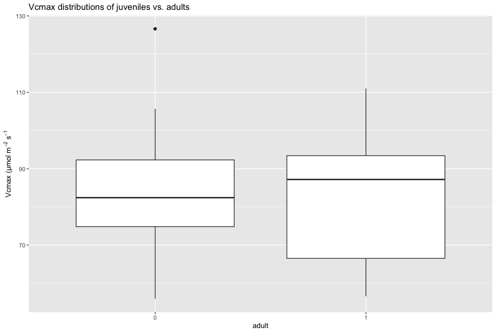
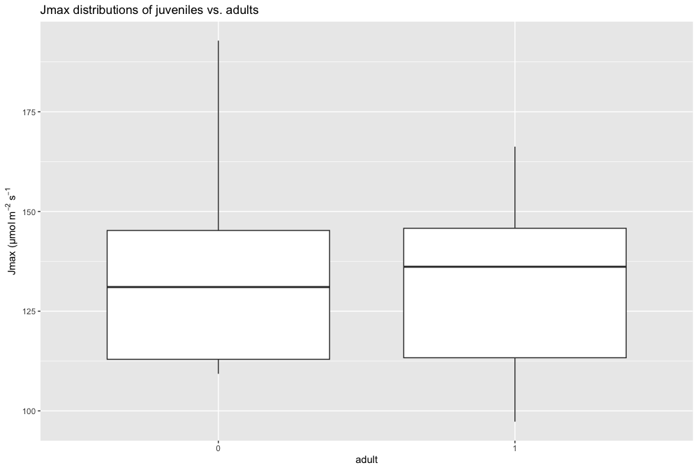

```{r setup, include=FALSE, echo=FALSE}
library(grateful)
get_pkgs_info(out.dir= "References/")
```

# Abstract

# Introduction

To this day, land and sea use change has remained the dominant driver of biodiversity decline, yet all signs point towards climate change taking front row in the coming decades [@jaureguiberry2022]. Ongoing climate change research is therefore pivotal in our efforts to protect biodiversity [@urban2016]. It will be especially important to understand the impact of climate change on forests. Terrestrial ecosystems currently store more carbon than they emit and forests, together with wetlands, are a crucial component in achieving this [@climate2021]. Forest biomes are already suffering from the direct and indirect effects of climate change [@scholten2021]. With warming at higher latitudes exceeding the global average now [@gauthier2015] and in the future [@price2013], northern temperate and boreal forests will be particularly vulnerable to climate change [@loarie2009].

Even though the early stages of tree development represent the most vulnerable stage in its development [@collier2022], they are rarely studied in relation to climate change [@fisichelli2014]. Trees need to establish themselves their offspring beyond their current limit in order to expand their range [@woodall2009]. However, there are many instances where the geographical limit of adults lies further north than the juvenile limit even though a longer time frame displays signs of northward range expansion [@boisvert-marsh2014, @sittaro2017]. This disparity could point towards a past pulse recruitment followed by a deterioration in conditions [@brown2005], yet definitive proof of this theory is still lacking. Assessing the reproductive potential of the current juvenile population near its northern limit might shed light on this question.

A great way to study the health and future of individual plants is to look at their photosynthetic performance [@farquhar1980]. Historically, biochemical estimates of leaf photosynthesis have been gathered through steady state gas exchange measurements [@duursma2015].This consists of measuring the carbon assimilation rate A for a range of internal CO2 concentrations Ci resulting in an A-Ci curve [@stinziano2017]. This curve is then used by the Farquhar-von Caemmerer-Berry photosynthesis model [FvCB model, @farquhar1980] to relate any estimates of photosynthetic capacity to the environmental conditions [@voncaemmerer2013]. Typically, two measures of photosynthetic capacity are derived: the maximum rate of ribulose-1,5-bisphosphate carboxylase oxygenase [Rubisco] carboxylation (Vcmax) and the maximal rate of electron transport (Jmax).

This steady state gas exchange method is very time consuming. Recently, @stinziano2017 developed a new technique: the rapid photosynthetic carbon assimilation CO2 responses method (rapid A-Ci response or RACiR). This method utilises non-steady-state measurements of leaf photosynthesis responses to varying CO2 concentrations to construct the A-Ci curves. The fast measurement rate of RACiR makes it the ideal tool to model this photosynthetic capacity of plants in the field [@stinziano2017] The same FvCB model can be applied on the curves to extract Vc,max and Jmax.

This field study seeks to examine the present and future effects of climate change on the physiology of temperate tree species near their northern range limit in Quebec, Canada using the rapid A-Ci response method. Yellow birch (Betula alleghaniensis Britton) will function as exemplary species. This research aims to answer the following questions in particular:

-   How does the photosynthetic capacity of yellow birch saplings and adults vary over a latitudinal gradient.

-   How does the fraction of carbohydrates allocated for growth vs. reproduction vary with latitude for yellow birch?

We hypothesize that photosynthetic capacity decreases with latitude but never reaches zero since other factors besides climate impact the current northern limit of yellow birch. This would mean the species is already trailing its climatic niche. Secondly, we expect that with increasing latitude, yellow birch individuals allocate relatively higher fractions of their producedcarbohydrates for growth, leaving less for other functions such as reproduction because the environmental conditions become gradually less suited for photosynthesis when moving northward.

# Methods

## Study area

The study area consists of five evenly spaced sites, each consisting of three plots, along a latitudinal gradient between 46 °N and 48 °N located close to 74.5 °W. All plots will be circular with an area of 400 m2 and are located within 25 km of their respective site centroid.

## RACiR

At each plot, gas exchange measurements of five adult and five sapling (diameter at breast height = 1-9 cm) trees will be taken with the LI-6800 Portable Photosynthesis System (Li-Cor Inc., Lincoln, NE, USA) using the rapid A/Ci curve [RACiR, @stinziano2017] method. These measurements will then be converted to relevant photosynthesis parameters using physiological models in order to see whether climate is currently the primary determinant of the species' northern limit as well as project the performance under future climatic conditions.

## Environmental parameters

In addition, tree core samples will be taken to determine the radial growth rates of the individuals as well as the spectral properties of each sampled leaf with a field spectroradiometer (PSR- 3500 Spectral Evolution Inc.) to complement the RACiR measurements. The trees of each plot will be mapped, the plant community will be recorded and the plot canopy openness measured using a LAI- 2200C Plant Canopy Analyzer (Li-Cor Inc., Lincoln, NE, USA). A soil sample will be taken that will be analysed in the lab to consider any soil variability. The other abiotic variables such as ambient temperature and vapour pressure deficit will be recorded by the LI-6800 system during measurements.

## Data analysis

The obtained A-Ci curves will be corrected by the plot's baseline curves [based on measurements in an empty chamber, @stinziano2017]. Next, all individual, corrected, curves will be fit in order to extract the values for Vc,max and Jmax [@dally-bélanger2022]. This is straightforward when using the *plantecophys* package [@duursma2015], developed for the R environment [@rcoreteam2022]. The other relevant parameters to estimate CO2 assimilation rates (mesophyll conductance gm, dark respiration Rd and photorespiratory compensation point \$\\Gamma\$\*) typically show little phenotypic variation and can be derived from literature [@farquhar1980]. Tree ring width will be prepared and measured using standard methods [@swetnam1985] and subsequently converted to basal area increments using the tree diameter.

In case of data normality, a multi-way ANOVA test [and possibly Tukey tests, @abdi2010] will be carried out to assess the significance of latitude on Vc,max and Jmax. Contrasting ratios of Vc,max (or Jmax) and basal area increments with latitude will allow to determine the different carbon allocation strategies of yellow birch over its range in Quebec. Lastly, the derived Jmax and Vc,max values will be used to model photosynthesis capacity for sampled individuals under future climatic conditions (e.g. temperature, VPD, atmospheric CO2) using the *Photosyn* function of the *plantecophys* package [@duursma2015].

# Results

## Fitting procedure

The fitting procedure is illustrated in the following figure.

{width="700"}

## Parameter output

The following table displays the resulting Vcmax and Jmax values from fitting all the different individuals:

| Tree ID  | Vcmax  | Jmax   | Tree ID | Vcmax  | Jmax   |
|----------|--------|--------|---------|--------|--------|
| 10_2_8   | 65.00  | 131.80 | 20_6_4  | 95.53  | 145.24 |
| 10_6_5   | 64.09  | 97.31  | 20_7_5  | 82.40  | 131.05 |
| 10_7_4   | 87.17  | 139.17 | 25_2_4  | 78.83  | 127.36 |
| 1000_1_5 | 95.68  | 166.25 | 25_3_3  | 74.82  | 122.48 |
| 1000_2_3 | 93.48  | 138.27 | 25_6_7  | 126.64 | 192.83 |
| 1000_5_6 | 111.02 | 158.62 | 25_7_3  | 55.93  | 112.32 |
| 1000_7_2 | 86.30  | 155.25 | 35_3_5  | 83.65  | 139.66 |
| 15_1_2   | 89.98  | 145.78 | 35_4_4  | 91.62  | 143.07 |
| 15_3_7   | 88.28  | 136.14 | 35_5_7  | 75.93  | 112.94 |
| 15_4_6   | 93.40  | 142.43 | 35_7_8  | 72.42  | 109.53 |
| 15_5_4   | 87.52  | 133.54 | 5_1_8   | 71.93  | 119.99 |
| 20_3_4   | 105.68 | 178.21 | 5_2_6   | 71.12  | 113.32 |
| 20_4_7   | 69.82  | 109.30 | 5_4_5   | 56.56  | 109.86 |
| 20_5_5   | 92.28  | 160.24 | 5_6_3   | 66.50  | 98.29  |

## ANOVA

The one-way ANOVA analyses revealed that there was no significant difference for Vcmax between the studied adult and juvenile yellow birch trees (F = 3.734, p = 0.541). For Jmax, he one-way ANOVA revealed that there was a weakly significant difference between the two life stages (F = 4.199, p = 0.0411).

This can also be seen in the following two figures that display the Vcmax and Jmax distributions grouped by life stage.

{width="400"}

{width="400"}

# Discussion

Our results show no differences in the Vcmax values between the sampled adults and juvenile yellow birch trees and only weakly significant differences between the life stages for Jmax. This is not what was expected based on other studies[see e.g., @boisvert-marsh2019]. This might stem from the fact that the northern limit of the yellow birch distribution is already trailing so much behind its climatic niche that the juveniles do not experience negative conditions for growth [@collier2022].

More expansion on discussion of results and their implications will to come.

# References
